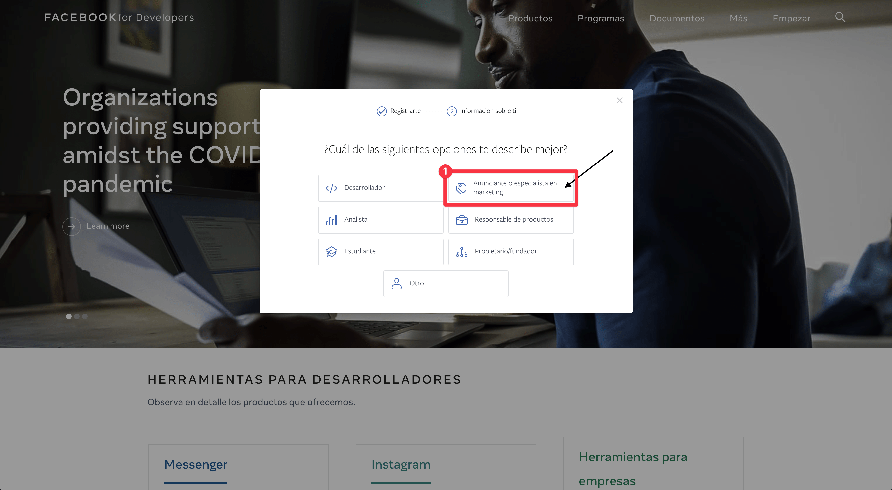

# Herramienta para el Análisis de Datos de una cuenta de Instagram
Bienvenido a la herramienta para obtener las métricas de cuentas de Instagram de negocios. En esta plataforma, podrás ejecutar el código que se conecta con Instagram directamente, que estará acompañado con una guía que llevará de la mano a quien utilice la herramienta para obtener las métricas deseadas. De tener alguna duda, revisar las preguntas frecuentes al final de la herramienta.

## ¿Qué necesito para utilizar la herramienta?
1. Una cuenta de Instagram de Empresa (es decir, con analíticas activadas)
2. Acceso a la cuenta de Facebook que está asociado al Instagram del que quieres obtener las analíticas.
3. Una aplicación en [Facebook Developers](https://developers.facebook.com/apps/).

### Pasos para utilizar la herramienta
1. Accede a la aplicación que creaste a través de https://developers.facebook.com/apps/

2. Copia el ID de Cliente y la Llave secreta del cliente, que podrás obtener al hacer click en Configuración Básica de la aplicación que generaste en https://developers.facebook.com/apps/

3. Llena los siguientes campos con los valores copiados del cliente.
4. Abre la página para las [Herramientas del API de Grafo de Facebook](https://developers.facebook.com/tools/explorer)
5. Selecciona Obtener Token de Acceso de Usuario siguiendo los pasos de la foto.

6. Confirma el acceso de Facebook 

7. Agrega los siguientes permisos para que la herramienta pueda utilizar acceder a la información de la cuenta de Instagram:  
    - instagram_basic
    - instagram_manage_comments
    - instagram_manage_insights
    - pages_read_engagement
    - pages_show_list
8. Genera el código (válido por 1 hora) haciendo click en Generate Access Token y acepta los permisos de Facebook.

9. Copia el token de acceso y llene el siguiente campo con el código entre comillas. Habrán numerales que indicarán instrucciones dentro del código. Después, presiona SHIFT+Enter en la casilla.
10. Prueba la conexión ejecutando la siguiente celda
11. Ingresa el nombre de la página de Facebook asociada con la cuenta de Instagram
12. Si después de terminar el paso 12, no hubo ningún error, introduzca el mes y el año del que se quieren obtener las métricas. Ejecuta las casillas de código
13. Si no quieres que las métricas lleguen hasta el día de hoy, especifica el año y mes de finalización de métricas. Al no hacerlo, se mostrarán las métricas de los post publicados desde el año y mes de inicio especificado hasta el día de hoy.
14. Ingresa el usuario de Instagram del que estás calculando las métricas, luego, ejecuta el código
15. Ejecuta para ver los mejores 5 posts
16. Ejecuta para ver los peores 5 posts según Engagement: Likes + Comments + Saves
17. Guarda el Archivo Excel

## Posibles preguntas sobre la Herramienta

### ¿Cómo me registro en Facebook Developers y creo mi aplicación?
1. Haz click en Empezar 

2. Verifica que la información en pantalla es la de la cuenta de Facebook asociada al instagram del que quieres obtener las métricas. Luego, haz click en Siguiente.

3. Rellena cómo usarás la plataforma. En nuestro caso "Anunciante o Especialista de Marketing"

4. Continúa el proceso. Haz click en Crear Primera App

5. Rellena la información del formulario y haz click en Crear Identificador de la App.

### ¿Qué hago si mi cuenta de Instagram no tiene un Facebook asociado?
Si tu cuenta de Instagram no está enlazada con una cuenta de Facebook, deberás seguir los siguientes pasos para vincularla.

### ¿Qué hago si mi cuenta de Instagram tiene un Facebook que no quiero que esté asociado?
Si tu cuenta de Instagram no está enlazada con la cuenta de Facebook que quieres, deberás seguir los siguientes pasos para desvincularlas.
